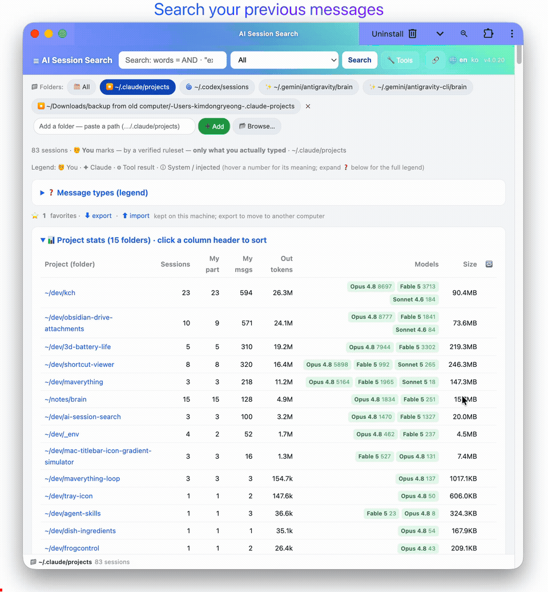
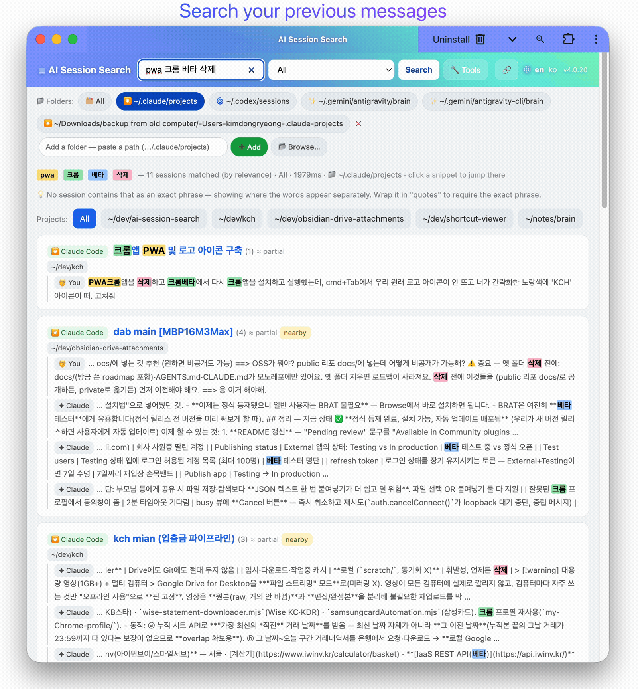
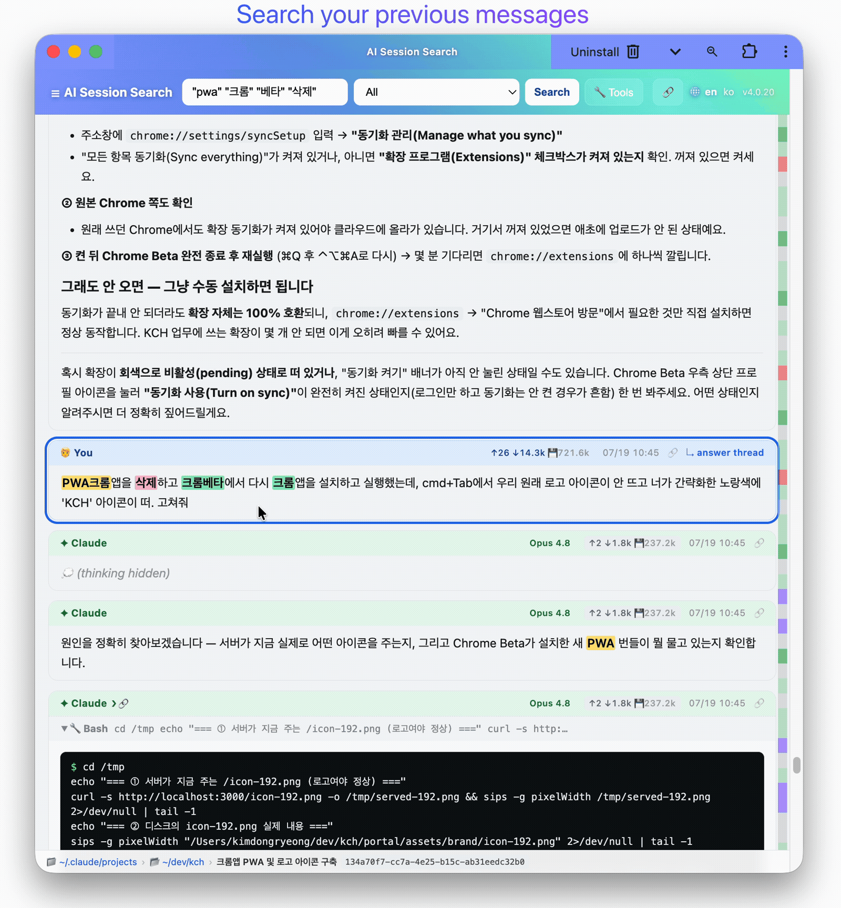
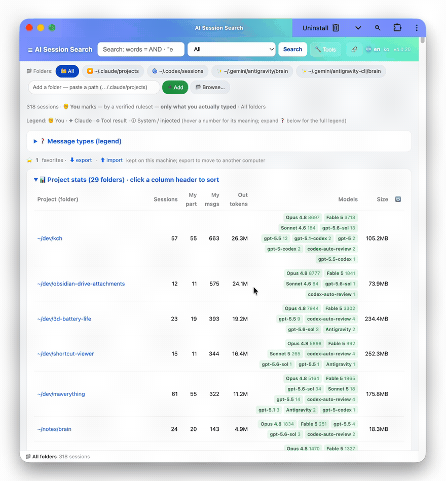
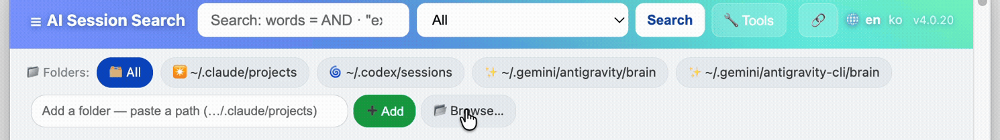
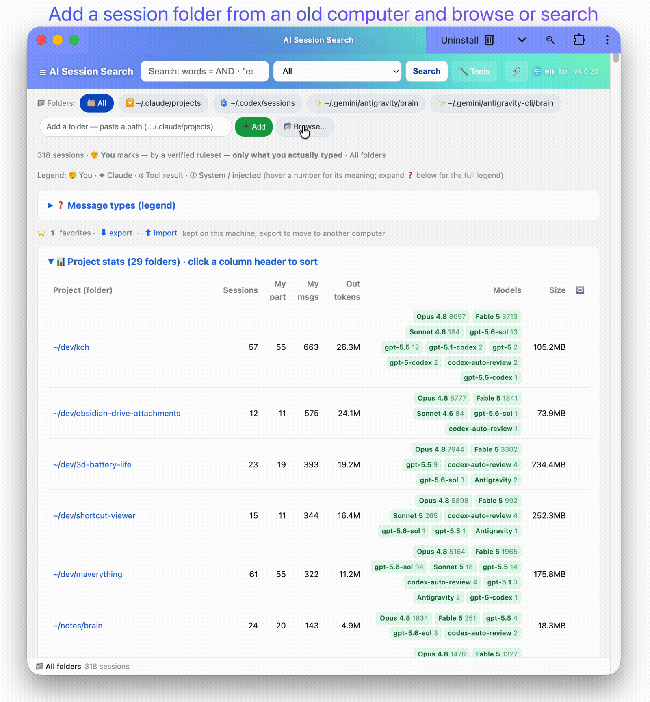
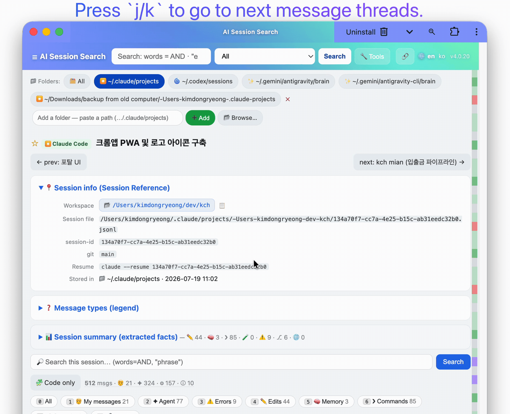
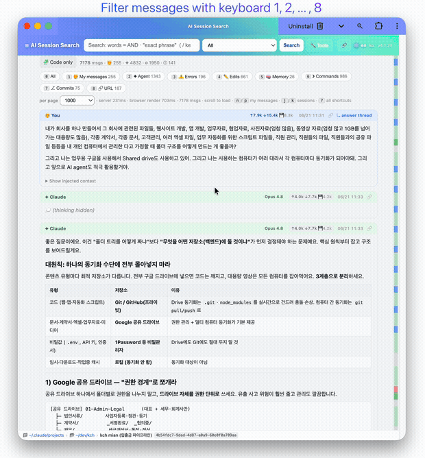
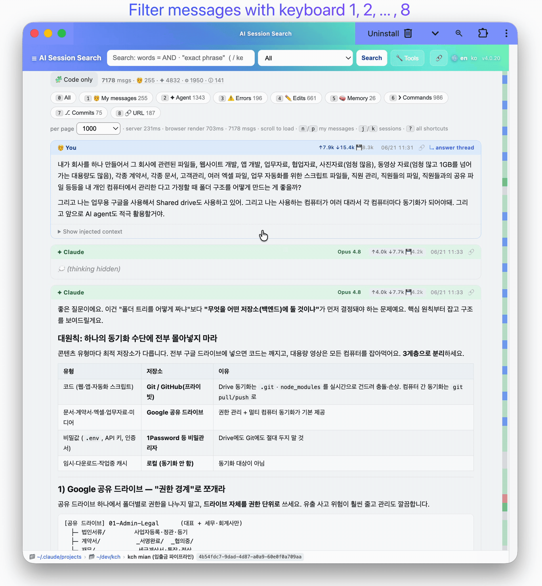
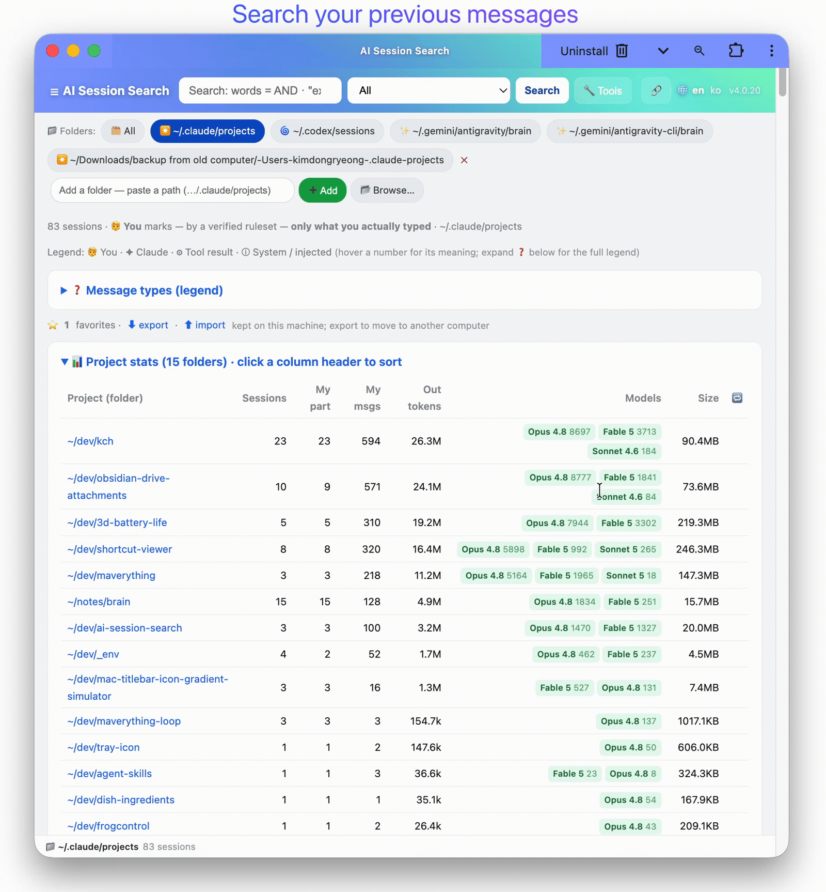

<div align="center">


# AI Session Search

### You solved this with Claude three weeks ago. Where did that conversation go?

Paste the sentence you half-remember — wrong words, missing words, doesn't matter — and
land on the exact passage in milliseconds. **Claude Code (Anthropic), Codex (OpenAI), Gemini
CLI, and Antigravity (Google)** — all your AI coding agents, one search box.

[**⬇ Get it now**](#-get-it-now) ·
[**🏠 Homepage**](https://kim-dongryeong.github.io) ·
[See it](#-see-it) ·
[For coding agents](#-for-coding-agents-mcp--cli--api--skill) ·
[Privacy](#-privacy)

[](https://github.com/kim-dongryeong/ai-session-search/releases/latest)
[](LICENSE)






</div>

---

## ⬇ Get it now

No Python, no terminal, no setup required — the downloads below are fully standalone (they
bundle their own Python, nothing else to install). Download it, double-click it, and it opens
in your browser. The server runs **only on your machine** — nothing is ever uploaded.

- **macOS** — [Download the app](https://github.com/kim-dongryeong/ai-session-search/releases/latest), open the `.dmg`, drag it to Applications, launch it.
- **Windows** — [Download the app](https://github.com/kim-dongryeong/ai-session-search/releases/latest) and double-click the `.exe`. That's it.
- **Linux** — [Download the tarball](https://github.com/kim-dongryeong/ai-session-search/releases/latest), unpack it, and run it.

> **Windows says "Windows protected your PC"?** That's SmartScreen being cautious about a
> new open-source app, not a real warning — click **More info → Run anyway**. On macOS, the
> app is signed and notarized by Apple, so it just opens.

**Prefer the terminal?** One line installs it and opens a demo:

```bash
pipx install git+https://github.com/kim-dongryeong/ai-session-search.git && aiss --demo   # (more below)
```

---

## 👀 See it

### 🔎 Search that forgives
Paste the sentence you half-remember, typos and all. A wrong word, a missing word, a whole
extra clause — it still finds the passage. Proximity-cluster ranking scores how tightly your
words sit *together*, so you land on the paragraph you're actually thinking of, not just any
message that happens to contain one of the words. And it's instant, even on thousands of
sessions — measured on the author's real history: the first search after opening dropped
from **~8 s to 10 ms**.



### 🗂️ Every AI tool, one search box
Claude Code, Codex, Gemini CLI, and Antigravity are auto-discovered the moment you open the
app — nothing to configure. Switched machines, or keeping an old project's sessions in a
backup folder? Add it: paste any path and it's searched too, including session folders
copied over from another computer.







### 🔗 Jump back in
Every result deep-links straight to the exact turn, already scrolled into view — no hunting
through a thousand-line transcript. Found the session you meant? Copy its resume command and
you're back in that exact conversation, in your terminal, mid-thought — on the machine where
that session's history lives.



### 📖 A transcript you'll actually want to read
Tool calls render as tool calls. Edits render as red/green diffs. Every generated code block
can be pulled out and copied with one click — instead of a raw JSON log pretending to be a
conversation.

### ⌨️ Keyboard-first
Gmail-style navigation: `j`/`k` move through results, `n`/`p` jump between *your own* messages,
`/` searches everything, `?` shows the full map. Built for people who'd rather not reach for
the mouse.



<!-- shot-optional -->


### 📊 Insights
Per-project stats — sessions, your share of the conversation, tokens, models used, size on
disk — sorted with a click. See where your AI time actually goes.

<!-- shot-optional -->


### 🔒 Private by design
Every search runs on `127.0.0.1` — your machine, and only your machine. Nothing you type,
paste, or read is ever sent anywhere. Full details in [Privacy](#-privacy).

---

## The one thing every other viewer gets wrong

**You see the messages you actually typed — not machine noise wearing a `role: "user"` label.**

Open any Claude Code / Codex / Gemini / Antigravity transcript and most `role:"user"` lines
aren't you (tool results, injected editor context, system reminders, and more). In a real
session **~95% of `role:user` lines are machine noise**, and every other viewer renders them
verbatim, as if you'd typed them.

AI Session Search uses an **empirically audited + adversarially verified ruleset** (one per
provider) so only text a human genuinely typed is marked **🧑 You** — full mechanism in
[How attribution works](#-how-attribution-works).

---

## 🤖 For coding agents (MCP / CLI / API / skill)

Your past sessions are a memory your coding agent doesn't have. AI Session Search exposes its
search engine so an agent can look up *how you actually solved something before* — across all
four providers, with the same correct attribution (`role:me` is only text you really typed),
over **faithful transcripts — no embeddings, no cloud, no external services, just a tiny
local index it builds for itself**. All local, all read-only.

**Query language** (every interface): words are AND-ed and matched nearby; `"quoted phrase"`;
field filters `file:` `cmd:` `code:` `error:` `role:me` `id:<uuid>`; `-word` excludes; scopes
`all | human | claude | chat | code | tool`.

<details open>
<summary><b>MCP server</b> — stdio, stdlib-only, no web server</summary>

Tools: `search_sessions(query, scope?, limit?)`, `get_session(sid | path, limit?)`,
`list_recent_sessions(provider?, limit?)`.

```bash
# Claude Code:
claude mcp add ai-session-search -- aiss --mcp
```
```jsonc
// or any MCP client:
{ "mcpServers": { "ai-session-search": { "command": "aiss", "args": ["--mcp"] } } }
```
</details>

<details>
<summary><b>CLI</b> — one-shot, no server (great as an agent's Bash tool)</summary>

```bash
aiss --search 'cmd:pyinstaller locales' --scope tool --limit 10
aiss --search 'role:me windows encoding' --json      # machine-readable
aiss --get <session-id>                               # full session as text
aiss --sessions --limit 20                            # recent sessions
```
</details>

<details>
<summary><b>JSON HTTP API</b> — while a server is running</summary>

```bash
curl -s 'http://127.0.0.1:8777/api/search?q=windows+encoding&scope=all&limit=10'
curl -s 'http://127.0.0.1:8777/api/session?sid=<session-id>'
curl -s 'http://127.0.0.1:8777/api/sessions?limit=20'
curl -s 'http://127.0.0.1:8777/api/roots'
```
</details>

<details>
<summary><b>Skill</b> — teaches an agent <i>when</i> to search past sessions</summary>

Copy [`skills/search-past-sessions/`](skills/search-past-sessions/SKILL.md) into your agent's
skills directory (e.g. `~/.claude/skills/`).
</details>

---

## 🔒 Privacy

**Everything runs on your machine; nothing is ever uploaded.** AI Session Search reads your
most private developer data — your entire AI coding history — so here's exactly how that's
kept private:

- **Local only.** Binds `127.0.0.1`; the server never leaves your machine. Nothing is uploaded.
- **Read-only.** It parses transcripts; it can't write to, delete, or resume a session.
- **Zero dependencies, no telemetry, no accounts.** Stdlib Python — nothing phones home…
- **…with exactly one exception, opt-out:** the update check. When enabled (default), at most
  once a day it makes a plain, unauthenticated `GET` to the public GitHub *releases* endpoint to
  see if a newer version exists. It sends **no identifiers and no transcript content** — just
  the request. Turn it off with `AISS_NO_UPDATE_CHECK=1`.
- **Verify it yourself** — the whole app is [one readable file](src/ai_session_search/app.py);
  don't take our word for it.

---

## 📦 Install & run from source (for developers)

Most people just want the [download above](#-get-it-now) — this section is the alternative
path for contributors and anyone who'd rather run it from a Python checkout.

```bash
# From a checkout, no install:
python3 ai-session-search.py            # compatibility shim at the repo root
python3 -m ai_session_search            # with src/ on PYTHONPATH

# As a command (pipx recommended; also uv / pip):
pipx install ai-session-search                                              # from PyPI
pipx install git+https://github.com/kim-dongryeong/ai-session-search.git    # from GitHub (works today)
uvx ai-session-search
pip install ai-session-search

aiss                                    # browse ~/.claude/projects (+ Codex + Gemini + Antigravity)
aiss --demo                             # bundled sample data
aiss ~/Downloads/.claude/projects --port 8778 --open
aiss --version
```

Defaults: binds `127.0.0.1` only, reads `$CLAUDE_CONFIG_DIR/projects` or `~/.claude/projects`,
and auto-discovers Codex, Gemini, Antigravity, and copied-from-another-machine data in the
in-app **📁 folder switcher**. Add any folder at runtime by pasting its path.

**Build a local macOS `.app`:** `./scripts/make-macos-app.sh --dmg` (a thin ~90 KB wrapper over
the installed `aiss`; needs Python). For a **zero-Python** app, use the notarized bundles from
[Releases](#-get-it-now).

**Requirement:** Python **3.9+**. Note Claude Code is a *Node* app, so a machine with
transcripts doesn't necessarily have Python (Windows has none by default). The native downloads
above bundle their own, so anyone can run them.

---

## 🌐 Language

English by default, fully translatable — switch live with the 🌐 header picker (remembered via a
cookie). A **Korean (한국어)** locale ships built in. Add your own with no rebuild: copy
`src/ai_session_search/locales/ko.json` to `<code>.json`, translate the values (keys are the
English strings), and drop it in the package `locales/` dir or your config dir. PRs adding
locales are very welcome.

---

## 🔬 How attribution works

See `classify_line` in [`src/ai_session_search/app.py`](src/ai_session_search/app.py). A genuine
human message is a `type:"user"` line that is **not** a tool result
(`toolUseResult`/`tool_result`), **not** `isMeta`/`isCompactSummary`/`promptSource==system`,
**not** a `<task-notification>`/`<command-*>`/`<system-reminder>`/`Caveat:` wrapper, **not** an
autonomous build-loop persona, and **not** `isSidechain`. Co-located
`<ide_opened_file>`/`<system-reminder>` blocks are folded away so the human's real text still
renders. Codex, Gemini, and Antigravity each get their own precision-first ruleset. **The
attribution tests are the contract: no machine-authored line may ever be classified as 🧑 You.**

---

## 🛠️ Development

```bash
python3 -m unittest discover -s tests -v   # attribution + markdown/tools + i18n + HTTP + API/MCP
```

CI runs the suite on Ubuntu/macOS/Windows × Python 3.9/3.14, then installs the package and checks
the `aiss` entry point. The whole app is one stdlib-only module
(`src/ai_session_search/app.py`) by design — no framework, no runtime dependencies, ever. See
[`docs/RELEASING.md`](docs/RELEASING.md) for how releases are cut, signed, and notarized, and
[`scripts/gen_demo.py`](scripts/gen_demo.py) for the `--demo` dataset.

## 🙌 Contributing

Issues and PRs welcome — especially new UI locales and attribution edge cases (attach a
*redacted* JSONL line). Keep it **stdlib-only**. Run the tests before opening a PR.

## Non-goals

No embeddings/semantic search, no LLM summarization, no heavy client-side syntax highlighters
(they freeze on 20k-line sessions), no external database or server to run, no cloud.

## License

[GPL-3.0-or-later](LICENSE). A finished end-user tool, distributed free — copyleft keeps every
fork and derivative open too. You can use, modify, sell, and self-host it; if you distribute a
modified version you must share its source under the GPL.
</content>
