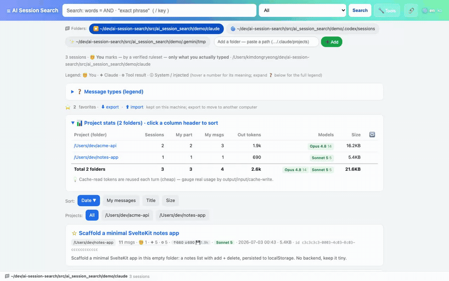
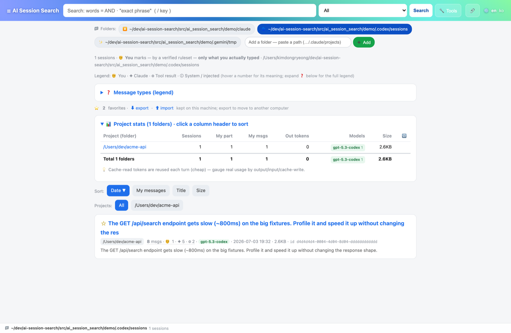
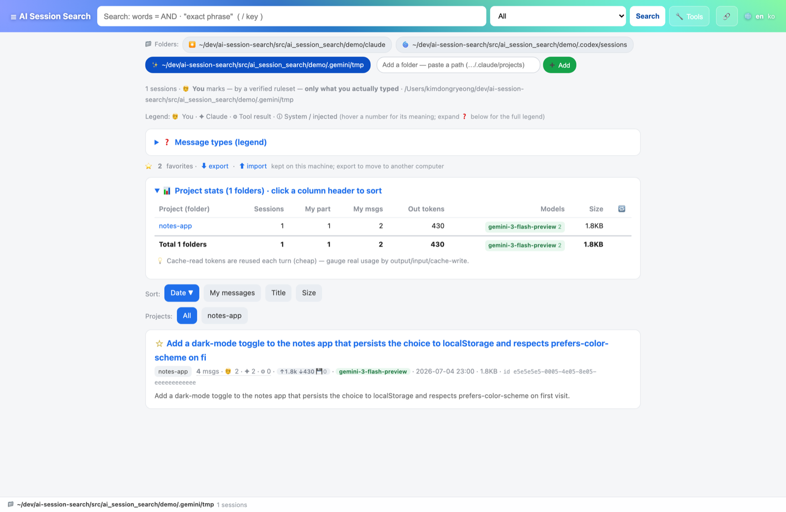
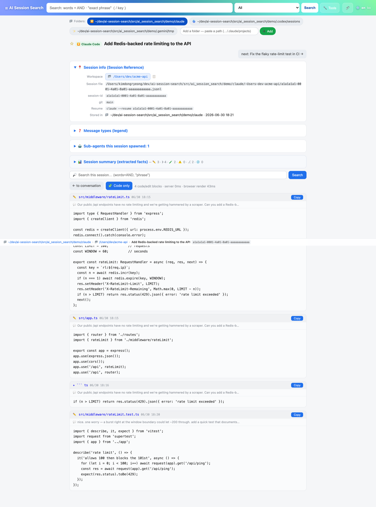
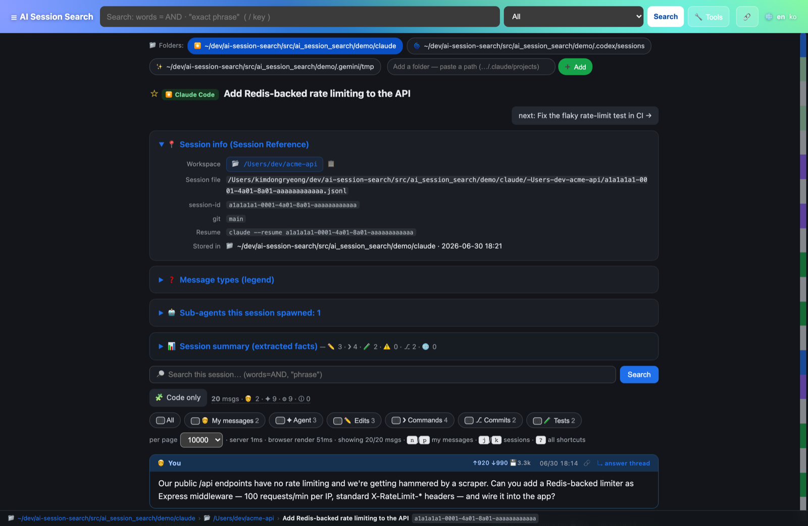

<div align="center">

# AI Session Search

**Search everything you and your AI coding agents have ever done — and let your next agent look it up.**

A local, read-only, **zero-dependency** viewer + full-text search engine for your
**Claude Code**, **Codex**, and **Gemini CLI** transcripts. It's the only one that knows
which words were *actually yours*.

[**⬇ Download**](https://github.com/kim-dongryeong/ai-session-search/releases/latest) ·
[**🏠 Homepage**](https://kim-dongryeong.github.io) ·
[Features](#-feature-tour) ·
[For coding agents](#-for-coding-agents-mcp--cli--api--skill) ·
[How attribution works](#-how-attribution-works)

[](https://github.com/kim-dongryeong/ai-session-search/releases/latest)
[](LICENSE)




</div>

---

## The one thing every other viewer gets wrong

Open any Claude Code / Codex / Gemini transcript and most lines are labelled `role: "user"`.
**Almost none of them are you.** They're tool results, injected IDE/editor context, system
reminders, task-notifications, slash-command output, subagent briefs, autonomous-loop
prompts. In a real session **~95% of `role:user` lines are machine noise** — and every other
viewer renders them verbatim, as if you'd typed them.

AI Session Search uses an **empirically audited + adversarially verified ruleset** (one per
provider) so only text a human genuinely typed is marked **🧑 You**. Everything else gets its
own category and is folded away. That one fix is what makes search, reading, and agent recall
land on *real intent* instead of transcript exhaust.

<div align="center">


</div>

---

## ⬇ Download — no Python required

Grab a build from the [**latest release**](https://github.com/kim-dongryeong/ai-session-search/releases/latest),
double-click, and it opens in your browser. The server runs **on your machine** — nothing is
uploaded, ever.

| OS | File | How to run |
|---|---|---|
| **macOS** (Apple Silicon) | `ai-session-search-macos-arm64.dmg` | Open the dmg → drag to Applications → launch. |
| **macOS** (Intel) | `ai-session-search-macos-x86_64.dmg` | same |
| **Windows** | `ai-session-search-windows-x64.exe` | Download → **double-click**. |
| **Linux** | `ai-session-search-linux-x86_64.tar.gz` | `tar xzf …` → `./ai-session-search` |

> **Windows shows "Windows protected your PC"?** That's SmartScreen being cautious about a
> brand-new open-source app (it isn't code-signed yet). Click **More info → Run anyway** — it's
> safe and the source is right here. The warning fades as more people download it.
> On macOS, the notarized `.dmg` opens cleanly; an un-notarized build just needs a right-click → **Open** the first time.

**Prefer the terminal?** One command, then try it on bundled sample data:

```bash
pipx install ai-session-search          # once it's on PyPI
# or install straight from GitHub (works today):
pipx install git+https://github.com/kim-dongryeong/ai-session-search.git

aiss --demo            # opens a browser on a synthetic Claude+Codex+Gemini dataset
aiss                   # …then point it at your real ~/.claude, ~/.codex, ~/.gemini history
```

---

## ✨ Feature tour

### 🔎 Full-text search that actually finds things

Relevance-ranked, per-term color highlighting, matches **within a turn**, across **nearby
turns** (proximity), or **anywhere in a session** — so a clue spread across three messages is
still found. It searches message text, tool-call arguments (Bash commands, file paths), *and*
code bodies (a `Write`'s content, an `Edit`'s diff). Field queries: `file:` `cmd:` `code:`
`error:` `role:me` `id:<uuid>`, plus `-exclude` and `"exact phrase"`.


### 🗂️ One place for Claude Code, Codex, and Gemini

Auto-discovers `~/.claude/projects`, `~/.codex/sessions`, and `~/.gemini/tmp`, each parsed with
the same attribution rigor and shown with a provider badge, model mix, token totals, and a
resume command. Grouped by workspace; click a column to sort per-project stats.

<table>
<tr>
<td width="50%"></td>
<td width="50%"></td>
</tr>
</table>

### 🧩 Code & diff extraction

**🧩 Code only** re-gathers every generated code block and file edit in a session — yours *and*
the agent's, each labelled and shown with a line of context — with one-click copy. Great for
"what did we actually change?"



### ⌨️ Built for the keyboard

Gmail-style navigation: `j`/`k` move through the session list or between sessions, `n`/`p` jump
between *your* messages, `Enter` opens the answer thread, digit keys toggle filter chips, `/`
searches everything, `f` finds within the session, `s` stars, `c` flips to code-only. Press
`?` for the full map.

<table>
<tr>
<td width="55%"></td>
<td width="45%"></td>
</tr>
</table>

### …and the rest

- **Correct attribution everywhere** — 🧑 You / ✦ Claude / 💭 Thinking / 🔧 Tool call /
  ⚙ Tool result / ⓘ System / 📋 Instruction / 🤖 Subagent, with an in-app legend. Technical
  blocks fold by default; a `🔧 Bash` shows the command, an `Edit` shows a red/green diff.
- **Markdown rendering** — GFM tables, fenced/inline code, lists, links; raw HTML always
  escaped; dependency-free renderer that doesn't choke on 20k-line sessions.
- **Extracted-fact digest** — files touched, commands, tests, commits, PR links, memory
  writes. Deterministic, no LLM.
- **Subagent threads** — sidechain/Task transcripts (including workflow agents) listed per
  session and openable; orchestrator briefs clearly labelled 📋 (never "you").
- **Live updates** — new messages append in place, chat-style, without a reload.
- **⭐ Stars that survive a machine change** — saved to a local file, with export/import.
- **Per-project stats**, event/error chips (⚠️ ❯ ⎇ 🧪 🔗), a structure minimap, dark mode,
  and a fixed status-bar breadcrumb.
- **In-app updates** — a slim bar tells you when a newer release exists (see [Privacy](#-privacy)).
- **`aiss --demo`** — a bundled synthetic dataset (all three providers, with tool calls,
  diffs, a subagent, commits, a branched session) so you can explore every feature without
  touching your real history. It's what these screenshots show.

---

## 🤖 For coding agents (MCP / CLI / API / skill)

Your past sessions are a memory your coding agent doesn't have. AI Session Search exposes its
search engine so an agent can look up *how you actually solved something before* — across all
three providers, with the same correct attribution (`role:me` is only text you really typed),
over **faithful transcripts with no embeddings, no database, no indexing step**. All local,
all read-only.

**Query language** (every interface): words are AND-ed and matched nearby; `"quoted phrase"`;
field filters `file:` `cmd:` `code:` `error:` `role:me` `id:<uuid>`; `-word` excludes; scopes
`all | human | claude | chat | code | tool`.

<details open>
<summary><b>MCP server</b> — stdio, stdlib-only, no web server</summary>

Tools: `search_sessions(query, scope?, limit?)`, `get_session(sid | path, limit?)`,
`list_recent_sessions(provider?, limit?)`.

```bash
# Claude Code:
claude mcp add ai-session-search -- aiss --mcp
```
```jsonc
// or any MCP client:
{ "mcpServers": { "ai-session-search": { "command": "aiss", "args": ["--mcp"] } } }
```
</details>

<details>
<summary><b>CLI</b> — one-shot, no server (great as an agent's Bash tool)</summary>

```bash
aiss --search 'cmd:pyinstaller locales' --scope tool --limit 10
aiss --search 'role:me windows encoding' --json      # machine-readable
aiss --get <session-id>                               # full session as text
aiss --sessions --limit 20                            # recent sessions
```
</details>

<details>
<summary><b>JSON HTTP API</b> — while a server is running</summary>

```bash
curl -s 'http://127.0.0.1:8777/api/search?q=windows+encoding&scope=all&limit=10'
curl -s 'http://127.0.0.1:8777/api/session?sid=<session-id>'
curl -s 'http://127.0.0.1:8777/api/sessions?limit=20'
curl -s 'http://127.0.0.1:8777/api/roots'
```
</details>

<details>
<summary><b>Skill</b> — teaches an agent <i>when</i> to search past sessions</summary>

Copy [`skills/search-past-sessions/`](skills/search-past-sessions/SKILL.md) into your agent's
skills directory (e.g. `~/.claude/skills/`).
</details>

---

## 🔒 Privacy

AI Session Search reads your most private developer data — your entire AI coding history — so
it is built to keep it that way:

- **Local only.** Binds `127.0.0.1`; the server never leaves your machine. Nothing is uploaded.
- **Read-only.** It parses transcripts; it can't write to, delete, or resume a session.
- **Zero dependencies, no telemetry, no accounts.** Stdlib Python — nothing phones home…
- **…with exactly one exception, opt-out:** the update check. When enabled (default), at most
  once a day it makes a plain, unauthenticated `GET` to the public GitHub *releases* endpoint to
  see if a newer version exists. It sends **no identifiers and no transcript content** — just
  the request. Turn it off with `AISS_NO_UPDATE_CHECK=1`.

---

## 📦 Install & run (with Python)

```bash
# From a checkout, no install:
python3 ai-session-search.py            # compatibility shim at the repo root
python3 -m ai_session_search            # with src/ on PYTHONPATH

# As a command (pipx recommended; also uv / pip):
pipx install ai-session-search                                              # from PyPI
pipx install git+https://github.com/kim-dongryeong/ai-session-search.git    # from GitHub (works today)
uvx ai-session-search
pip install ai-session-search

aiss                                    # browse ~/.claude/projects (+ Codex + Gemini)
aiss --demo                             # bundled sample data
aiss ~/Downloads/.claude/projects --port 8778 --open
aiss --version
```

Defaults: binds `127.0.0.1` only, reads `$CLAUDE_CONFIG_DIR/projects` or `~/.claude/projects`,
and auto-discovers Codex, Gemini, and copied-from-another-machine data in the in-app **📁 folder
switcher**. Add any folder at runtime by pasting its path.

**Build a local macOS `.app`:** `./scripts/make-macos-app.sh --dmg` (a thin ~90 KB wrapper over
the installed `aiss`; needs Python). For a **zero-Python** app, use the notarized bundles from
[Releases](#-download--no-python-required).

**Requirement:** Python **3.9+**. Note Claude Code is a *Node* app, so a machine with
transcripts doesn't necessarily have Python (Windows has none by default). The native downloads
above bundle their own, so anyone can run them.

---

## 🌐 Language

English by default, fully translatable — switch live with the 🌐 header picker (remembered via a
cookie). A **Korean (한국어)** locale ships built in. Add your own with no rebuild: copy
`src/ai_session_search/locales/ko.json` to `<code>.json`, translate the values (keys are the
English strings), and drop it in the package `locales/` dir or your config dir. PRs adding
locales are very welcome.

---

## 🔬 How attribution works

See `classify_line` in [`src/ai_session_search/app.py`](src/ai_session_search/app.py). A genuine
human message is a `type:"user"` line that is **not** a tool result
(`toolUseResult`/`tool_result`), **not** `isMeta`/`isCompactSummary`/`promptSource==system`,
**not** a `<task-notification>`/`<command-*>`/`<system-reminder>`/`Caveat:` wrapper, **not** an
autonomous build-loop persona, and **not** `isSidechain`. Co-located
`<ide_opened_file>`/`<system-reminder>` blocks are folded away so the human's real text still
renders. Codex and Gemini get their own precision-first rulesets. **The attribution tests are
the contract: no machine-authored line may ever be classified as 🧑 You.**

---

## 🛠️ Development

```bash
python3 -m unittest discover -s tests -v   # attribution + markdown/tools + i18n + HTTP + API/MCP
```

CI runs the suite on Ubuntu/macOS/Windows × Python 3.9/3.14, then installs the package and checks
the `aiss` entry point. The whole app is one stdlib-only module
(`src/ai_session_search/app.py`) by design — no framework, no runtime dependencies, ever. See
[`docs/RELEASING.md`](docs/RELEASING.md) for how releases are cut, signed, and notarized, and
[`scripts/gen_demo.py`](scripts/gen_demo.py) for the `--demo` dataset.

## 🙌 Contributing

Issues and PRs welcome — especially new UI locales and attribution edge cases (attach a
*redacted* JSONL line). Keep it **stdlib-only**. Run the tests before opening a PR.

## Non-goals

No embeddings/semantic search, no LLM summarization, no heavy client-side syntax highlighters
(they freeze on 20k-line sessions), no database, no cloud.

## License

[GPL-3.0-or-later](LICENSE). A finished end-user tool, distributed free — copyleft keeps every
fork and derivative open too. You can use, modify, sell, and self-host it; if you distribute a
modified version you must share its source under the GPL.
